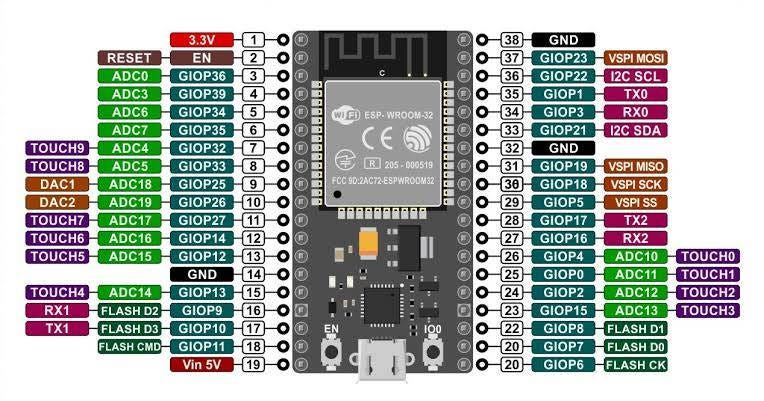
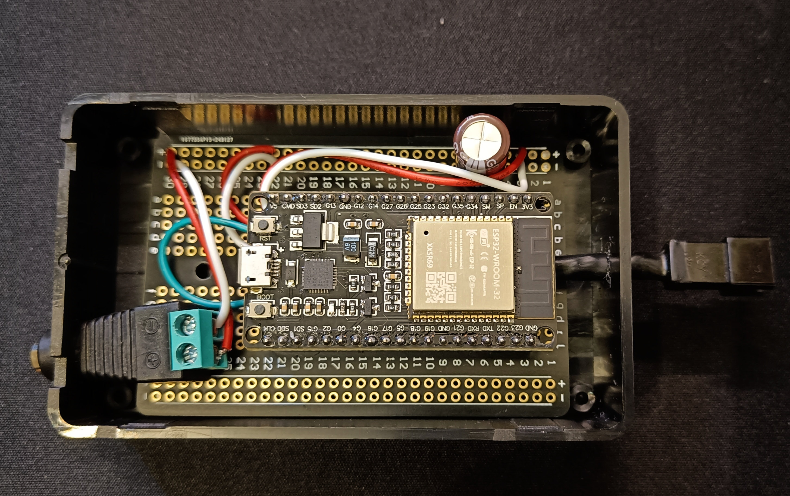
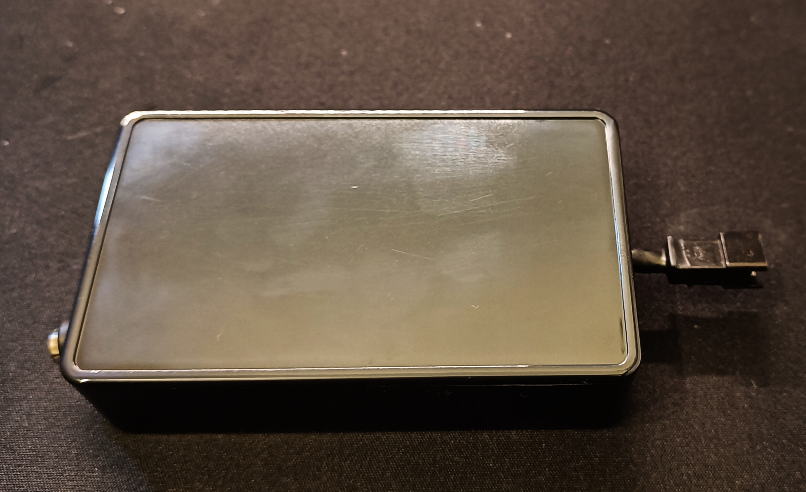

<h1> GUIDE - FOSS LED controller </h1>
A guide on how to build a controller for you LEDs and control it using Wled. 

<!-- description -->

  

    Huge shout-out to <a target="_blank" href="https://github.com/Aircoookie">Aircoookie</a> and his <a target="_blank" href="https://github.com/Aircoookie/WLED">WLED repository</a>. You should definetely go check it out. 
  

  

    This guide summarizes how I build a controller for my LED strip and gives you step by step DIY instructions so you can do it too.
  

  

    If you are more of a visual person you can also check the guide on <a target="_blank" href="https://www.youtube.com/watch?v=_wZEJPShvmI">Makers Mashup</a> channel.
  

<!-- Index-->
<h2>
  Table of Contents
</h2>
<ul>
  <li><a href="#what-you-need">What you need</a></li>
  <li><a href="#building">How to build the controller</a></li>
  <li><a href="#wled">Install WLED</a></li>
  <li><a href="#config">Configurations</a></li>
  <li><a href="#resources">Resources</a></li>
  <li><a href="#disclaimer">Disclaimer</a></li>
</ul>

<!-- List of components needed -->
<h2 id="what-you-need">What you need</h2>

Here is a list of the different components and equipment you will need to build the controller.

<ul>
  <li>
    <a target="_blank" href="https://www.amazon.de/dp/B0CH9JYNMH?psc=1&_encoding=UTF8&tag=flhub-21&linkCode=ur2&linkId=5e8e8686c2825231051a55fb24c847f2&camp=1638&creative=6742">ESP32</a><a target="_blank" href="https://www.amazon.de/dp/B01CDTEFAQ?psc=1&_encoding=UTF8&tag=flhub-21&linkCode=ur2&linkId=b3f8b093f5ddb8f3de39363ae62fabd5&camp=1638&creative=6742">BTF lighting LED strip</a>
  </li>
  <li>
    <a target="_blank" href="https://www.amazon.de/-/en/Gebildet-Electric-Flexible-Connection-Oxygen-Free/dp/B0BG3W15YT?dib=eyJ2IjoiMSJ9.1KIqM_msf5bOJzSkH1ew8mpkRV9ON6T-JkpoG9VBrVNiQsBOy89PVl9_OxJ3WE52dZQ2NwPvhQfohTIVtA9uTdrEeeiJJAPTrq25blI_kGLVwsQcBmtw9uFV5yNYrgs_dZ3xnOrRc1s9acYoimm7y3bca-84lVwHo9U46wYOgbKhuAMUjt-Xy6J_0iJHgT5fWcUpq3opJyRQpXT_dCYemLRv1_L1Vhb6aBbEgtndBn2SdkT2JgZK1j0tg-6RY1d7_cKGvbd6RSDbv6b0286VtzrH7L6tx3arj0Nl6txS4KA.qZ71FKLbXAXQjmTYETNYcB8YM56PsqjJkf6iahdto4Q&amp;dib_tag=se&_encoding=UTF8&tag=flhub-21&linkCode=ur2&linkId=576c6aababe3138b3a46847e62dd7fc6&camp=1638&creative=6742">22AWG cable</a>
  </li>
  <li>
    <a target="_blank" href="https://www.amazon.de/-/en/ELECTROCOOKIE-Solderable-Chopping-Electronics-Gold-Plated/dp/B07ZV8FWM4?dib=eyJ2IjoiMSJ9.R8hifUH4Z4qV9mqzrm8pVhDFbzQceLYM5MTMFrhtIJ_TUnCFGWB4L2hBIKa5Kvxg9CJFdvNoug8qikf_ctEGvEToVgCKg-ne8Q_VB1-ZWeL6DX10raUdNJ_N66KOxJEF3Fnw6C_Cle0v2xN8uNRN08peYrERas7X0KwwmtmGJ8bSHUUgeLFxoYTy6OaHKGxBDL8XnqQ_XeBmko_0kLd10P6hJlL349v9eJYQZcgpcrqBEKb8CvrxGSpQe73oA-2bh7iFQ0sCTnmDmMb1hwucuTw0B6XMj__RIquTRz2JRgQ.OutE2IY-4E1z_wexHk4j18ZhPaH_eyhJy9p5aLWQquk&amp;dib_tag=se&_encoding=UTF8&tag=flhub-21&linkCode=ur2&linkId=06c6f7d91402c0890aab6fb216574041&camp=1638&creative=6742">Solderable Bread Chopping Board </a>
  </li>
  <li>
    <a target="_blank" href="https://www.amazon.de/dp/B00LPWIM98?psc=1&_encoding=UTF8&tag=flhub-21&linkCode=ur2&linkId=211c7eebfa54a5625c0967cfe80e132f&camp=1638&creative=6742">1000 uF Capacitor</a>
  </li>
 <li>
   <a target="_blank" href="https://www.amazon.de/-/en/3PIN-SM/dp/B01DC0KIT2?dib=eyJ2IjoiMSJ9.UtMqHJDKSZoZ1n7XYeASs_LOCJQviBdJ2hbNelUnE73aG3rCD2k4SYQxh5w89FOuyeTolSPvgeRr88dwWai2-tWnz33-2M6h_oGuuPVpzzXFwXpagqb7qjM5qO7-u7ZKpqTWJ-0T5FA_4RVL1t9M8rTS5mZ1R7pzq-v4Z1PVxczj0gB07y3TvFEXha4Ma6Hn-vvfgxE_WxRjtzSHInapuLMN1ENZxhq4laLXCe-2Baaus1DBMZZRVC7TQeVT7PgHQrogDc2XGGtKN52d0spcW8_FYQVx8QX0DByOLJLaXmg.Fhwc6EovLJEJ3IFUYlHUDwpyZz8oSAg3lMohqoosjO0&amp;dib_tag=se&_encoding=UTF8&tag=flhub-21&linkCode=ur2&linkId=765d2f649aec2928511a67563f6c5e24&camp=1638&creative=6742">3 pin LED connector</a>
 </li>
  <li>
    <a target="_blank" href="https://www.amazon.de/dp/B09CH8QBJN?&_encoding=UTF8&tag=flhub-21&linkCode=ur2&linkId=ec213bb0bc51d7d075939477411e1021&camp=1638&creative=6742">Case</a>
  </li>
  <li>
    <a target="_blank" href="https://www.amazon.de/-/en/17893/dp/B003H9CJ1Y?dib=eyJ2IjoiMSJ9.1R0jS4Qs2cda5Vry4e1XR3COvrSttgudBiP6oy1Mad84Zw80DkovYrZlh-LTGmDObYHKzmLY02CbwRUElC7DvjP1ZpMLxtXfm66u__qt7EJGdxD6i2rd_7U7iJV1iZhzpi6uxOvsppBPs6iT4oZ1NE06-uFc0DGiXmy0irFDYA5T7iMKS1q2xbN8xgjwafnaACx-EreX4KyT36zUPXP1ZQM2I6HtFLZ_LuG0e4sMeG3TNhbvlM_uIBCj0a8z3YPgdLNLqRnWwaiH2hI7sIJ_uMrzeEJ7utU9OKtCIQHUXCU.uLzurU4WGO1fWf42sTHAUK-8oSEZfgObOKKGq2DNjWU&amp;dib_tag=se&_encoding=UTF8&tag=flhub-21&linkCode=ur2&linkId=4cc363e9362d0626f88950d4f2d42cf8&camp=1638&creative=6742">Heat shrink tube</a>
  </li>
  <li>
    <a target="_blank" href="https://www.amazon.de/-/en/Assortment-Stackable-Breakaway-Arduino-Prototype/dp/B07CWSXY7P?dib=eyJ2IjoiMSJ9.9S4dcSq_QjxNncwZaJt6LTsVEFLR6baM750-POiAPlTPRPMnXLWtuxgnXBOPSBLyXXEgesAwi7zr4cv_vRUaGKAKq7RMpNaNNVFt6BvwNjD2UkL85pTaZbAqTLigxbXSAOpCCBjd_lSMX6Xvc5r1dG153KQfdZ9hlhbF3WYC-RdcKYDwn8ThsslTZH-A36A951nUj0_Od-f4iKntVeMwEADftXnAPBg32junYtkZsnJr-Xo4437rW_1z7pjYSsKHBvpfrsm0i6l6O8bt0r23vpB-6aJrWDnbdVLw4m9gleA.S8EH7mYp2sJtMj58zSWPIOzfWFB6FEunUeBjXi6NWEw&amp;dib_tag=se&_encoding=UTF8&tag=flhub-21&linkCode=ur2&linkId=63876dabbd4d9554c9ce62958c4daa03&camp=1638&creative=6742">Pin Header </a>
  </li>
  <li>
    <a target="_blank" href="https://www.amazon.de/-/en/Female-Socket-Adapter-Camera-Connector/dp/B0BR6PQ64L?dib=eyJ2IjoiMSJ9.xtkUgB1ky1P8tc5s6qeKrgIpzcyIA9Xhy6qzCY3h6sHoPLDgMCGV3CA5KY31nTPmz9NJ5LrlSj08RFL5E6lOE6DL1W9_FWHJoY2gtFOa6mcqHuA37a0TqhXYcXqrXqxqlW1sEJH-5FwJEJlg3UF_xr0qTZM8Z2-D39HB_8Dtyg8yCVU9gcd7iftaoUhs4yjgJoS3sK-xJ2BGEnGRewl7TAtu5OFMQnfKjtuMatmZwwM.88Hvhw5fT4OJ7XrCiFp1HHDeUyVXpAIQQyvYxa94d5g&amp;dib_tag=se&_encoding=UTF8&tag=flhub-21&linkCode=ur2&linkId=7c92873d73a4de67695ca3c6d5a25988&camp=1638&creative=6742">Female DC plug connector</a>
  </li>
  <li>
    <a target="_blank" href="https://www.amazon.de/-/en/Switching-100V-240V-Universal-Transformer-Cordless-5-V-2-pieces/dp/B0BK9Q7S7C?dib=eyJ2IjoiMSJ9.MuJPF2nk797D8SB68dCuU6pESXZkdWflvJ5wWsCqpfgP0XaXGdqGNUW_5HB2ltISqnOiuvACVHedkRojFlRPdcPPd88zdwPJ0puYbjitP_RhLDPK74johAlDyieK5EjOG1lS8Hx-b-Um5zwvJOtWURMhBlQkAdwChCBOVeJe6TwDOg9le1zn3yaW9yIw8m0jQ9FbVk8sLRanvkzSvbBXsaWYtlJJCzsaTZWm1K-JTFYBpIGQfZfySsI6xeo6ls2ipfGwikGW4V14DZ8TxPAkC5RVVgC3PVuBBZQpt14zcl8.QEH9vBQViOvQ2_pwbXfh69gI2b73HjpJXNfiifj2cgA&amp;dib_tag=se&_encoding=UTF8&tag=flhub-21&linkCode=ur2&linkId=43ddafd6e9e31534e84c4d84b92d70bf&camp=1638&creative=6742">5V (2A) Power supply adapter </a>
  </li>
  <li>
    <a target="_blank" href="https://www.amazon.de/gp/product/B09CKTYTVJ?psc=1&_encoding=UTF8&tag=flhub-21&linkCode=ur2&linkId=af94a1985c185519fb49b90e8135d98a&camp=1638&creative=6742">Soldering Iron (a basic kit like this would do the job)</a>
  </li>
  <li> 
    <a target="_blank" href="https://www.amazon.de/-/en/KX1650-QS/dp/B004XZFZL2?dib=eyJ2IjoiMSJ9.6_3pvUAPvgLmuM6bTS-6orW4c7AqlDlIyZhdIQgcOcPUk73jSQQarBxr5BaFTKnVKc5WOQduULp3i0eJ5Nn53ay3H7uionF4Iz2eFeWDApCzjk--W60XNghmwJGmTrq3HDhCKBI2ILhez5A60M7XLVeXwDXxvTmCwpEjYi9Vo4wZT3ZQKVVSaWEfLaknDpVbWQCzXu1iKt0wYttrTip3MyUzbdlCq3c1CRI9pibUjEI.W23293o5taMBLDBOsPx_EJ_auIy54M_Rsp74nNF3msk&amp;dib_tag=se&_encoding=UTF8&tag=flhub-21&linkCode=ur2&linkId=26f122594f93b4ca88e5c517d80f5f2b&camp=1638&creative=6742">Heat gun (an hair dryer also works)</a>  
  </li>
  <li> 
    <a target="_blank" href="https://www.amazon.de/gp/product/B000EBN174?psc=1&_encoding=UTF8&tag=flhub-21&linkCode=ur2&linkId=343df24964547b315cc2deefd445b94e&camp=1638&creative=6742">Drill</a>
  </li>
</ul>

<h6>
  Disclaimer: Some of the links above are affiliate links. This means that, at zero cost to you, I will earn an affiliate commission if you click through the link and finalize a purchase.
</h6>

<!-- Instructions -->
<h2 id="building">How to build the controller</h2>
<ol>
  <li>Prepare all the components and warm up your soldering iron.</li>
  <li>Prepare the ESP32 by adding the header pins. Technically you could also solder your ESP32 directly to the breadboard, but by adding the header pins you can always remove it and easily reuse it for other projects. It also has the advantage of making it possible to pass cables under it and makes the soldering of the cables easier. If you decide not to use the header pins, I advise you to do this step after you finish all other connections.</li>
  <li>Solder the header pin connectors to the breadboard. Do it while they are connected to the ESP32 to make sure you get the position right. Solder it closer to one of the sides of the breadboard, so you have enough space for the DC plug on the other side.</li>
  <li>Now we will connect the power rails to the ground and the Vin 5V input on the ESP32. Check the diagram below to detect the pins where the connection needs to be made. To simplify, use a red cable going from the positive rail to the 5V pin and a black (or white) cable to the Ground pin. For simplicity, use the end of one of the rails. Position 2 or 3 would be great. Let's leave position one for the DC plug adapter.</li>
  

  
   

    
   

  <li>Now, we connect the capacitor to the power rails. Make sure you get the positive to the positive and negative to the negative. Swapping the polarity can cause the capacitor to <a target="_blank" href="https://youtu.be/xjchpcL63Zo?si=n7bRZdduHTCb5K_G&t=18">explode</a>.</li>
  <li>We can now solder two cables (do one red, one black for simplicity) to position 1 or the power rails. Make sure you use the right lenght for the cables. The other end go into the positive and negative position of the DC plug adapter.</li>
  <li>At this stage, I would make a pause on the microcontroller and turn to the box. I used a very simple electronic junction box with 10x6x2.5 cm. Before you can put the microcontroller inside, you will have to drill a hole for the DC plug in one end and a smaller whole to pass the 3 pin female LED strip connector. I made a small circular whole for this and left the connector part outside of the box as it was easy to drill a hole than to cut the perfect square for the connector. **Make sure you have all the precautions while drilling and that you measure the position and size of the necessary hole**.</li>
  <li>Before passing the 3 pin connector through its hole in the case and solder it in place, I decided to add a heat shrink tube around it for better looks and extra protection, as part of this cable would hang out of my case. Do not wrap the tube around the whole cable as you still need enough space to maneuvering it inside the case while soldering. They go to different places in the breadboard.</li>
  <li>Heat the tube with a hot gun or a hair drier (good home solutions).</li>
  <li>You can now pass it through its whole in the case. Afterwards, you will have to solder the positive (red cable) and negative (whie cable) to their positions on the breadboard. Solder it to the other end of the rail (e.g. position 30). Its important that at the end the power rail has the following order of connections DC plug > ESP32 > Capacitor > LED.</li>
  <li>After soldering the power cables, you can now solder the data cable (green cable) to the breadboard on the GPIO4 position of the ESP32. Check the diagram. You will have to remove the ESP32 for this step so you can access the breadboard.</li>
  <li>You can now put the board in place inside your case.</li>
  <li>Congrats! Your microcontroller is built! Now, you can install WLED on the ESP32.</li>
  
  

  
Below some examples using the controller I made:

  

    
  

  
Board with all connections soldered, without the ESP32

  
  

    
  

  
Board with all connections soldered, with the ESP32

  
  

    
  

  
Closed case

</ol> 

You have to remove the ESP32 from the board and procede with the WLED installation.

<b>Note:</b> When connecting the LEDs, make attention to the arrows printed on the strip. It tells you the direction of the data.

<!-- Installation -->
<h2 id="wled">How to install WLED</h2>
Remove the ESP32 from the board and plug your ESP32 to your computer via USB. 
If you are on <b>Windows</b> you will have to install the right drivers for your ESP microcontroller. Refer to this page to download them: <a target="_blank" href="https://docs.espressif.com/projects/esp-idf/en/latest/esp32/get-started/establish-serial-connection.html">Espressif Website ESP32></a>
If you are on <bold>Linux</bold> or <b>MacOS</b> the VCP drivers are usually installed. 
You can install WLED by opening the wled install page on a chromium browser and following the steps indicated: <a target="_blank" href="https://install.wled.me/">Install.WLED</a>
Note: You will need to know which COM port is your ESP32. If you do not know, follow the steps on the Espressif website above. 

Once you went through all the steps, you can control your ESP32 device via the defined address on the browser. 

You can also download the WLED app and control it from your phone.

<!-- Configs -->
<h2 id="config">Configurations</h2>

In your WLED app or on the browser page go to <b>Settings > LED Preferences</b> and make sure you have the following settings configured:

<li><b>Maximum current:</b> Keep it less than 1A (850 mA is the default)</li>
<li><b>Enable automatic brightness limiter:</b> Enable (you can disable it for extra brightness but it might damage the leds)</li>
<li><b>LED voltage:</b> 5 V</li>
<li><b>LED outputs:</b> select your leds</li>
<li><b>Color Order:</b>some trial and error here. Try each option until you get the right order</li>
<li><b>Length:</b>Put the number of LEDs you have (e.g. 1 strip with 30 leds, put 30. 2 strips with 30 each, put 60</li>
<li><b>GPIO:</b>It should be automatically set to the GPIO you are using on the ESP32. If not, correct it. In this example I used the GPIO4</li>

<!-- Resources -->
<h2 id="disclaimer">Resources</h2>

<a target="_blank" href="https://docs.espressif.com/projects/esp-idf/en/latest/esp32/get-started/establish-serial-connection.html"><b>Esspressif Website:</b></a> Check it for drivers and further data on your microcontroller device

<a target="_blank" href="https://kno.wled.ge/"><b>WLED website:</b></a> All schematics, basics, tutorials and links to the project from Aircoookie

</ü><a target="_blank" href="https://install.wled.me/"><b>Install.WLED:</b></a> WLED installation website

<a target="_blank" href="https://github.com/Aircoookie/WLED"><b>WLED github repository</b></a>

<a target="_blank" href="https://www.youtube.com/watch?v=_wZEJPShvmI"><b>Makers Mashup channel:</b></a> Video tutorial similar to this project. They added a microphone and a 3D printed case. 

<a target="_blank" href="https://youtu.be/6rmErwU5E-k?si=IwWvO1K9KMLs7F1D"><b>Soldering tutorial:</b></a> First time soldering? Check this crash course from vermy.

<!-- Disclaimer -->
<h2 id="disclaimer">Disclaimer</h2>
I do not own the code for the WLED app. All the work and effort belongs to Christian Schwinne (Aircoookie) to whom I thank for the creation of WLED. 

